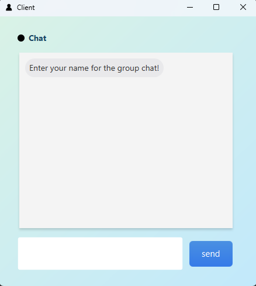
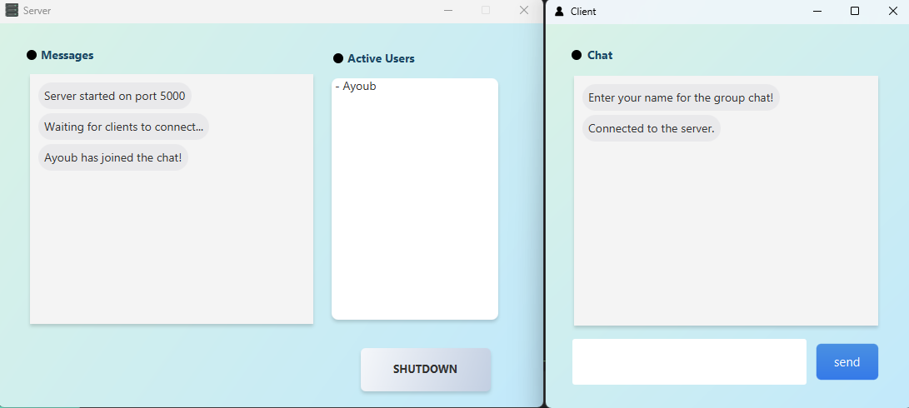
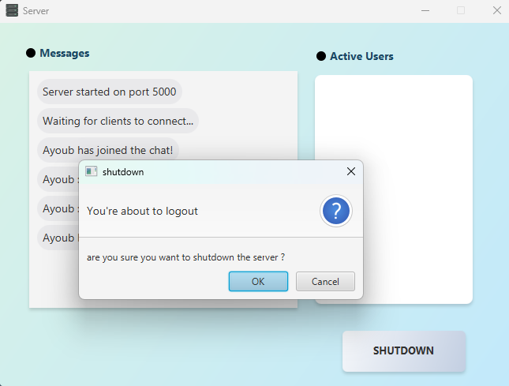

# JavaFX Multi-Client Socket Chat App

A robust multiple client chat application built using Java sockets and JavaFX. The user interface is designed using SceneBuilder and styled with CSS.

## Overview

This project demonstrates how to create a multi-client chat application using Java sockets for networking and JavaFX for a modern, responsive UI. The server handles multiple client connections simultaneously, broadcasting messages to all connected clients in real-time.

## 🚀 Technologies Used

- **Java Sockets:** For handling network communications.
- **JavaFX:** For creating the user interface.
- **SceneBuilder:** For designing the FXML layouts.
- **CSS:** For styling the UI components.

## screenshots

 

